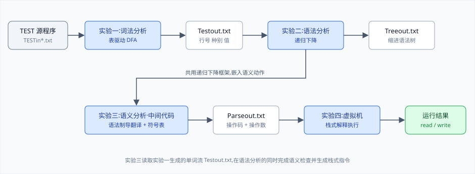
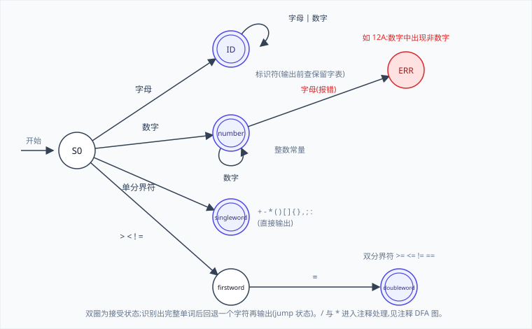
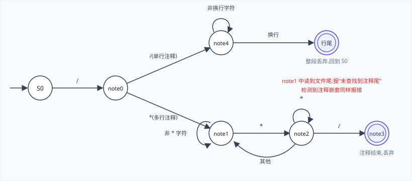
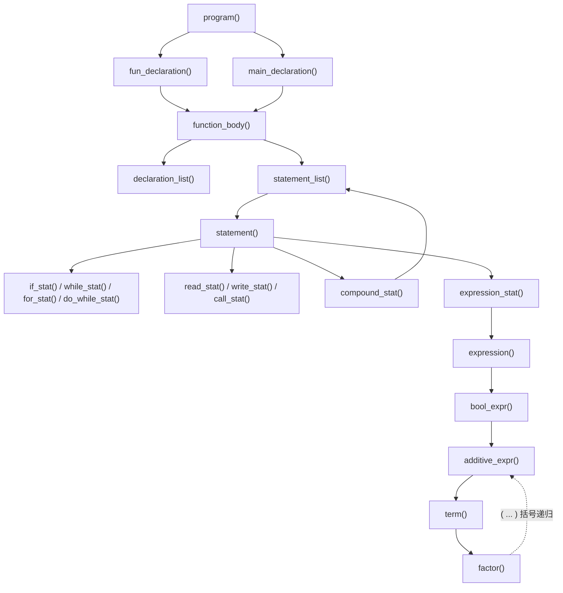
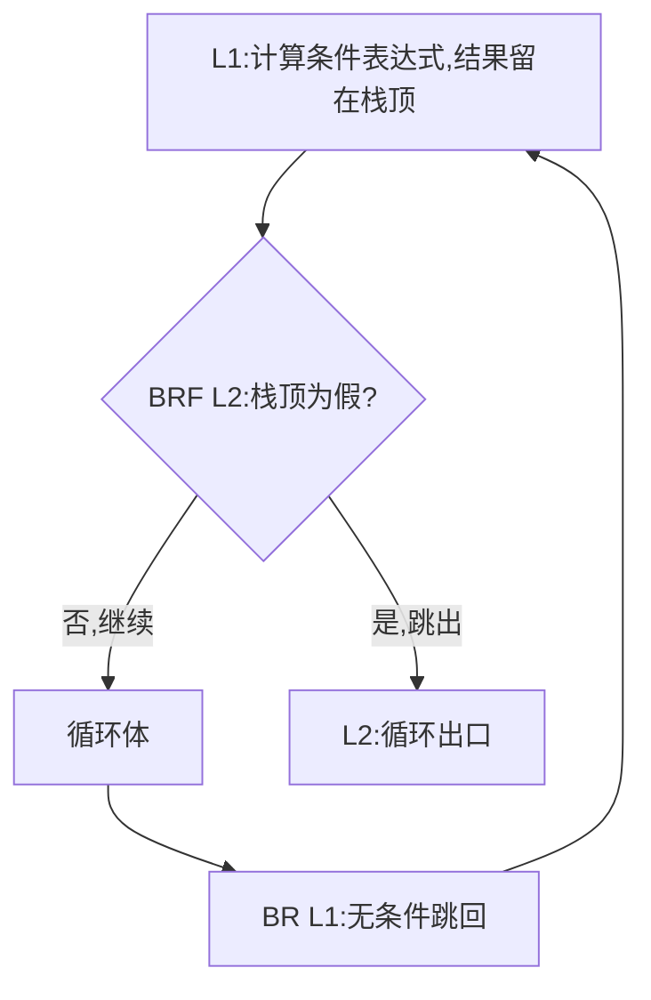
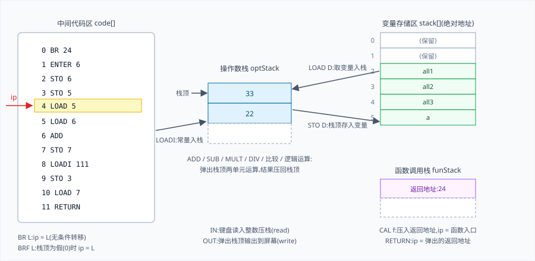

# TEST 语言编译器 —《编译原理》课程大作业

本仓库是《编译原理》课程四个实验的完整存档:用 C++ 从零实现 TEST 语言的整条编译链,
从源程序一路走到可以运行的结果。实验报告的全部必要内容都已整合进本 README,
它是仓库唯一的文档。

> 词法分析(表驱动 DFA)→ 语法分析(递归下降)→ 语义分析与中间代码生成(语法制导翻译)→ 栈式虚拟机解释执行

四个实验前后衔接,后一阶段直接消费前一阶段的输出文件,合起来就是一个能真正跑起来的小型编译器。

## 目录

- [总体架构](#总体架构)
- [TEST 语言一览](#test-语言一览)
- [实验一:词法分析(表驱动 DFA)](#实验一词法分析表驱动-dfa)
- [实验二:语法分析(递归下降)](#实验二语法分析递归下降)
- [实验三:语义分析与中间代码生成](#实验三语义分析与中间代码生成)
- [实验四:栈式虚拟机](#实验四栈式虚拟机)
- [端到端示例](#端到端示例)
- [仓库结构](#仓库结构)
- [构建与运行](#构建与运行)
- [编码说明](#编码说明)

## 总体架构



各阶段通过约定的文本文件衔接:

| 文件 | 产生者 | 内容 |
| --- | --- | --- |
| `TESTin*.txt` | 手写 | TEST 语言源程序 |
| `Testout.txt` | 实验一 | 单词流,每行为 `行号 种别 值` |
| `Treeout.txt` | 实验二 / 三 | 缩进形式的语法树 |
| `Parseout.txt` | 实验三 | 中间代码,每行为 `操作码 操作数` |
| 屏幕交互 | 实验四 | `read` 从键盘读入,`write` 输出到屏幕 |

实验三并不是独立的一遍扫描:它在实验二的递归下降框架中嵌入语义动作(语法制导翻译),
一遍分析同时产出语法树、符号表和中间代码。

## TEST 语言一览

TEST 语言是一个类 C 的教学语言,支持全局/局部变量、带参数和返回值的函数、
分支循环与输入输出。一段综合示例(`实验四/虚拟机/TESTinY.txt`,即后文端到端示例的输入):

```c
int all1;
int all2;
int all3;
int a;
function sum(int x,int y)
{
int e;
int b;
e=x+y;
all3=111;
return e;
}
function mul(int p,int q)
{
int d;
all3=55;
d=p*q;
all3=222;
}
main()
{
int a;
int b;
int c;
read c;
for(a=2;a<3;a=a+9)
{
b=a+99;
}
if(a>=b)
a=a-b;
else
b=b-a;
//这是注释
/*这也是注释*/
call b=sum(22,33);
do
{
a=a+999;
}while(a==0);
write all3;
write b;
write c;
}
```

要点:

- 保留字共 10 个:`if` `else` `for` `while` `do` `int` `write` `read` `return` `call`,
  对大小写不敏感(`iNt` 也识别为 `int`),标识符则区分大小写;
- 注释支持 `//` 单行与 `/* ... */` 多行,注释不允许嵌套(嵌套会被检查出来并报错);
- 数据类型只有整型 `int`;
- 官方基线的保留字只有 8 个(`if` `else` `for` `while` `do` `int` `write` `read`),
  `return` 与 `call` 是为支持函数扩充自行加入的;官方词法中双分界符除
  `>=` `<=` `==` `!=` 外还定义了 `&&` `||`;
- 结构约定:全局变量在最前集中声明;最后一个定义必须是无原型的 `main`;
  被调函数的定义必须出现在主调函数之前,这样一遍扫描就能在调用点查到函数入口。

核心文法(按最终实现整理,`{}` 表示重复、`[]` 表示可选、`ε` 表示空):

```text
<program>          ::= <declaration_list> { <fun_declaration> } <main_declaration>
<fun_declaration>  ::= function ID '(' 参数表 ')' <function_body>
<main_declaration> ::= main '(' ')' <function_body>
<function_body>    ::= '{' <declaration_list> <statement_list> '}'
<declaration_list> ::= { <declaration_stat> }
<declaration_stat> ::= int ID ;
<statement_list>   ::= { <statement> }
<statement>        ::= <if_stat> | <while_stat> | <for_stat> | <do_while_stat> | <read_stat>
                     | <write_stat> | <compound_stat> | <expression_stat> | <call_stat>
                     | <return_stat>
<if_stat>          ::= if '(' <expr> ')' <statement> [ else <statement> ]
<while_stat>       ::= while '(' <expr> ')' <statement>
<for_stat>         ::= for '(' <expr> ; <expr> ; <expr> ')' <statement>
<do_while_stat>    ::= do <statement> while '(' <expr> ')' ;
<return_stat>      ::= return <expression> ;
<write_stat>       ::= write <expression> ;
<read_stat>        ::= read ID ;
<compound_stat>    ::= '{' <statement_list> '}'
<expression_stat>  ::= <expression> ; | ;
<call_stat>        ::= call ID [ = ID ] '(' 实参表 ')' ;
<expression>       ::= ID = <bool_expr> | <bool_expr>
<bool_expr>        ::= <additive_expr> { (> | < | >= | <= | == | !=) <additive_expr> }
<additive_expr>    ::= <term> { (+ | -) <term> }
<term>             ::= <factor> { (* | /) <factor> }
<factor>           ::= '(' <additive_expr> ')' | ID | NUM
```

官方基线文法中 `<fun_declaration>` 与 `<call_stat>` 的括号内为空(函数一律无参)。
在此基础上做的扩充:`do ... while` 与 `return` 语句、带参数与返回值的函数、
条件中的多重判断(`&&` `||`)。

## 实验一:词法分析(表驱动 DFA)

代码:`实验一/源/词法.cpp`

输入字符流文件,输出单词流文件 `Testout.txt`,同时删除注释、空格等无用符号,
在控制台连续报告词法错误。识别过程完全由一张 15 状态、9 类输入符号的
**状态转换矩阵** `transTable` 驱动:先用 `alphabet` 映射表把当前字符归类成列号,
再查表完成状态迁移,主循环里没有任何针对具体单词的分支逻辑。

识别器对应的确定有穷自动机形式化定义为 M = (Q, Σ, q0, F, δ):

- 状态集 Q = {`S0`, `ID`, `number`, `singleword`, `firstword`, `doubleword`,
  `note0` … `note5`, `sto`, `jump`, `ERR`},初态 q0 = `S0`,
  除 `S0` 与中转状态 `jump` 外均为终态;
- 输入符号按字符类划分(即下表的列),δ 就是那张 15×9 的转换矩阵 `transTable`。

字符分类(`alphabet` 映射,列号即转换表的列):

| 列号 | 字符类 | 具体字符 |
| --- | --- | --- |
| 0 | 非法字符 | 不在字母表中的一切字符 |
| 1 | 数字 | `0`-`9` |
| 2 | 字母 | `a`-`z` `A`-`Z` |
| 3 | 单分界符 | `+` `-` `:` `(` `)` `[` `]` `{` `}` `,` `;` |
| 4 | 首分界符 | `>` `<` `!` |
| 5 | 等号 | `=` |
| 6 | 斜杠 | `/` |
| 7 | 星号 | `*` |
| 8 | 空白 | 空格、Tab |

分界符的识别策略:

- 相互无冲突的单分界符连接成一个字符串保存,读入字符落在这个串里就直接识别;
- TEST 的所有双分界符第二个字符都是 `=`,因此把它们的首字符 `>` `<` `!`
  单独归为"首分界符"类:遇到后再多读一个字符,是 `=` 就拼成
  `>=` `<=` `==` `!=`,否则按单分界符输出并回退读头;
- `/` 需要特判:后随 `*` 则转入注释子自动机,否则输出除号。

单词识别的主体 DFA:



`/` 和 `*` 引出的注释处理子自动机(`note0` 到 `note5` 六个状态),
单行、多行注释都在词法阶段被整体丢弃:



控制台对每个单词给出 `[○]`(正常)或 `[×]`(出错)标记,可连续查错不中断。
错误类型包括:

| 出错状态 | 报告信息 |
| --- | --- |
| ID | ID 出现非法字符 |
| number | 数字中含有非数字或 ID 以数字开头(如 `12A`) |
| note3 / note5 | 注释嵌套 |
| singleword | 连续使用单分界符或注释嵌套 |
| S0 | 非法字符 |

综合错误用例 `TESTin1.txt` 一次运行即可连续报出全部问题:数字开头的标识符 `12A`、
大小写混写的保留字 `iNt`(合法,验证不敏感)、双分界符 `a!=10`、
多余的注释闭合 `/*SS ;*/A*/`、跨行多行注释等。

词法分析入口封装为 `TESTscan()`,返回 0 表示分析成功、1/2 表示输入或输出文件
打开失败、3 表示存在词法错误;后续实验都直接调用该函数完成第一阶段。

输出的单词流格式为 `行号 种别 值`,保留字与分界符的种别就是其本身:

```text
1     int int
1     ID all1
1     ; ;
2     int int
2     ID all2
...
```

另有一个表驱动法的热身练习 `实验一/E1/表驱动lex.cpp`:识别模式
`(a|b)^n, 1<=n<4` 的最小 DFA,用来验证"转换表 + 驱动函数"的框架。

## 实验二:语法分析(递归下降)

代码:`实验二/语法分析5/语法分析.cpp`(最终版;`语法分析` 至 `语法分析4` 为迭代过程)

输入实验一产出的单词流,采用**自顶向下的递归下降法**:文法中的每个非终结符
对应一个同名函数,负责识别由该非终结符推出的串;终结符与当前单词匹配则读头后移,
非终结符则调用对应函数。前提是文法不含左递归,凡左递归产生式都先等价改写成
重复形式,例如 `<declaration_list> ::= <declaration_list> <declaration_stat> | ε`
改写为 `<declaration_list> ::= { <declaration_stat> }`,对应函数才不会无限自调用。
函数调用层次与文法层次一一对应:



分析的同时把每个识别到的成分挂到语法树上
(节点结构 `struct tree { string data; vector<tree*> son; }`),
最后按深度缩进输出到 `Treeout.txt`:

```text
<program>
->     <declaration_list>
->     ->     <declaration_stat>
->     ->     ->     int
->     ->     ->     all1
->     ->     ->     ;
->     <fun_declaration>
->     ->     function
...
```

**错误处理**:分析函数用返回值传递错误码,主循环把出错行号与错误码记入 `err` 数组后
跳过出错语句继续分析,做到一次运行报出多处语法错误;只要存在语法错误就只在控制台
报错,不生成 `Treeout.txt`(树文件仅在分析成功时输出)。
反例 `语法分析5/TESTinN.txt` 在循环体内故意漏写分号,用于验证连续查错。错误码含义:

| 错误码 | 含义 | 错误码 | 含义 |
| --- | --- | --- | --- |
| 1 | 缺少 `{` | 6 | 缺少标识符或返回值 |
| 2 | 缺少 `}` | 7 | 缺少操作数 |
| 3 | 缺少 `;` | 10 | 缺少参数 |
| 4 | 缺少 `(` | 11 | 缺少保留字 |
| 5 | 缺少 `)` | 12 | 返回值为空 |

## 实验三:语义分析与中间代码生成

代码:`实验三/语义分析/语义分析.cpp`

采用**语法制导翻译**:在实验二递归下降代码的相应位置插入语义动作,
一遍分析同时完成语义检查与面向栈式机器的中间代码生成,输出 `Parseout.txt`。

符号表用 `vector` 维护,同时容纳变量与函数两类符号;中间代码存放在定长数组中。
数据结构(最终版前端 `实验四/虚拟机/语义分析3.cpp`;实验三初版尚无 `isReturn`,
作用域标记也只是占位):

```c
struct symbol {                // 符号表表项
    char name[20];             // 标识符名字
    int address;               // 变量:存储地址 / 函数:代码入口
    enum symbolType kind;      // function 或 variable
    int paraNum = 0;           // 函数的参数个数
    string range = "全局";     // 作用域:全局 或 所属函数名
    bool isReturn = false;     // 函数是否带返回值
};
struct code {                  // 中间代码
    char operationCode[10];    // 操作码
    int operand;               // 操作数
} codes[200];
```

语义检查项与符号表的查重/查找规则:

| 错误码 | 检查内容 | 判定规则 |
| --- | --- | --- |
| 12 | 函数名重复定义 | 函数名在全表范围内唯一 |
| 13 | 变量重复定义 | 名字与作用域都相同才算重复,不同函数允许同名变量 |
| 14 | 标识符未声明就使用 | 查遍符号表无命中(如 `TESTinN.txt` 中未声明的 `b`) |

设计上的要点(实验心得):

- 查找按"名字 + 种类"二元组匹配,变量与函数因此可以同名互不干扰;
- 用"全局域 / 函数域"标记符号所处作用域:命中当前函数域立即返回,命中全局域
  先记下位置继续扫描(后续的局部命中会覆盖它),因此局部变量可以遮蔽全局同名变量;
- 变量直接分配**绝对地址**(`address = offset++`)。教师给出的参考方案是相对寻址:
  每进入一个函数就把局部偏移 `offset` 重置为 2(0、1 预留给返回地址等),运行时
  再做地址重定位;本实现取消了这一步,所有变量统一编绝对地址,中间代码里只出现
  地址、不出现名字,虚拟机无需符号表即可执行,也免去了地址漂移。

以 `while` 语句为例,生成的跳转结构如下(`if`、`for`、`do-while` 同理,
差别只在回填的位置):



生成的中间代码形如(`TESTinY.txt` 对应的 `Parseout.txt` 开头,
第 0 条 `BR 24` 跳过函数体、直达 `main` 入口):

```text
BR              24
ENTER           6
STO             6
STO             5
LOAD            5
LOAD            6
ADD             0
STO             7
LOADI           111
STO             3
LOAD            7
RETURN          0
...
```

## 实验四:栈式虚拟机

代码:`实验四/虚拟机/虚拟机4.cpp`(最终版)+ 配套前端 `语义分析3.cpp`
(在实验三基础上完善了带参函数与 `call` 赋值)

两点设计决策:虚拟机**直接解释执行**中间代码,省去翻译为机器代码的过程;
整型输入输出(`IN`/`OUT`)内建在虚拟机里,避免与外部 I/O 例程连接的复杂性——
`read` 从键盘读入,`write` 输出到控制台。

虚拟机读入 `Parseout.txt`,围绕四个部件解释执行:代码区 `code[]`
(`struct Code { char opt[10]; int operand; }` 数组)与指令指针 `ip`、
动态的操作数栈 `optStack`(`vector<int>`)、按绝对地址访问的静态变量区
`int stack[2000]`、动态的函数调用栈 `funStack`(`vector<int>`):



指令系统(操作码 + 一个操作数,`_` 表示不使用):

| 指令 | 语义 |
| --- | --- |
| `LOAD D` | 将地址 D 的变量值压入操作数栈 |
| `LOADI a` | 将常量 a 压入操作数栈 |
| `STO D` | 操作数栈顶出栈,存入地址 D |
| `ADD` `SUB` `MULT` `DIV` | 次栈顶(左操作数)与栈顶(右操作数)运算,结果留在栈顶 |
| `EQ` `NOTEQ` `GT` `LES` `GE` `LE` | 弹出两单元比较,结果 1/0 压回栈顶 |
| `AND` `OR` `NOT` | 逻辑运算(NOT 只对栈顶取反) |
| `BR lab` | 无条件转移:`ip = lab` |
| `BRF lab` | 栈顶出栈,为假(0)则 `ip = lab` |
| `IN` | 从键盘读入整数压栈(对应 `read`) |
| `OUT` | 弹出栈顶输出到屏幕(对应 `write`) |
| `CAL adr` | 调用函数:返回地址压入 `funStack`,`ip = adr` |
| `ENTER n` | 进入函数体开辟空间,n 为该函数的变量个数(改用绝对地址后保留为空操作) |
| `RETURN` | 从 `funStack` 弹出返回地址,`ip` 跳回 |

几点说明:

- 二元运算的实现不做两次弹栈再压栈,而是**原地改写次栈顶**后退栈一次,
  例如 `SUB`:`optStack[n-2] = optStack[n-2] - optStack[n-1]; pop_back();`
- 官方指令集中还定义了 `STOP`(停止执行),本实现未用到它:`ip` 走过最后一条
  指令(即 `main` 结束)循环自然退出,虚拟机停机;
- `ENTER` 源自官方"栈式动态内存分配、以函数调用为单位在运行栈中分配空间"的
  设计要求;改用绝对地址后它退化为空操作,但操作数仍记录着各函数的变量个数。

**函数调用**:参数与返回值全部经操作数栈传递,以 `call b=sum(22,33)` 为例
(节选自 `TESTinY.txt` 对应的 `Parseout.txt`,行首为指令序号):

```text
57  LOADI  22     ; 实参依次压入操作数栈
58  LOADI  33
59  CAL    1      ; 返回地址压入 funStack,跳到 sum 入口
                  ; ── sum 入口 ──
 2  STO    6      ; 按逆序弹栈存入形参的绝对地址:y
 3  STO    5      ; x
    ...
10  LOAD   7      ; 返回值 e 压回操作数栈
11  RETURN        ; 弹出返回地址跳回
                  ; ── 回到调用点 ──
60  STO    13     ; 栈顶的返回值存入 b,完成 call 赋值
```

`虚拟机.cpp` 至 `虚拟机4.cpp` 记录了从"相对地址 + ENTER 开辟栈帧"
演进到"绝对地址直接寻址"的过程,编号越大版本越新。
虚拟机没有实现数组、`switch` 等真正程序语言所需的许多特征,数据类型也只有
`int`,但已足以体现编译器从源码到执行的主要环节。

## 端到端示例

以 `TESTinY.txt`(见上文"TEST 语言一览")走完整条流水线,
虚拟机启动后 `read c` 等待键盘输入,输入 `7`:

```text
词法分析成功
语法分析成功,已生成语法树
(单词流与中间代码逐行回显,此处省略)

输入数据:
7
输出:111
输出:55
输出:7
```

结果与程序语义一致:`call b=sum(22,33)` 中 `sum` 把全局变量 `all3` 置为 111
并返回 55 赋给 `b`,`read c` 读入的是 7,因此 `write all3; write b; write c`
依次输出 111、55、7。

## 仓库结构

```text
.
├── docs/images/                     本 README 的配图
├── 实验一/
│   ├── E1/表驱动lex.cpp             表驱动框架热身:识别 (a|b)^n, 1<=n<4
│   ├── 源/词法.cpp                  词法分析器(最终版)
│   ├── 源/TESTin*.txt               测试用例与输出样例
│   └── TEST/Project1/源.cpp         词法 + 语法联调的独立工程
├── 实验二/
│   ├── E2/E.cpp                     练习
│   └── 语法分析/ … 语法分析5/       递归下降分析器的 5 个迭代版本(5 为最终版)
│       └── 语法分析/老师的语法分析.cpp   教师参考实现
├── 实验三/
│   ├── 语义分析/语义分析.cpp        语义分析 + 中间代码生成
│   ├── 语义分析/TESTinY|N|E.txt     综合用例 / 未声明变量反例 / 修正版
│   └── 语义分析2.0.zip              中间版本代码快照
└── 实验四/
    └── 虚拟机/
        ├── 虚拟机.cpp … 虚拟机4.cpp     栈式虚拟机的 4 个迭代版本(4 为最终版)
        ├── 语义分析2.cpp / 语义分析3.cpp 配套编译前端(3 为最终版)
        └── TESTin*.txt                  各阶段测试用例
```

测试用例的命名约定:`TESTinY` 为综合正确用例;`TESTinN` 含未声明变量,
用于验证语义检查;`TESTin1` 为词法错误大杂烩(非法标识符 `12A`、
注释嵌套等);`老师TEST用例.txt` 及其改正版为教师提供的验收用例。

## 构建与运行

源码为 Visual Studio 工程(C++,Windows):

1. 用 Visual Studio 打开对应实验目录下的 `.sln`(如 `实验一/源/词法分析.sln`),
   或新建空工程后把所需 `.cpp` 加入同一工程;
2. 实验二、三、四的程序调用词法模块的 `TESTscan()`,需与 `实验一/源/词法.cpp`
   一同编译链接;实验四同时需要 `语义分析3.cpp`(提供 `parse()`)与 `虚拟机4.cpp`;
3. 运行后按提示输入源文件名(不带 `.txt` 后缀,文件需位于工作目录),
   各阶段的 `Testout.txt`、`Treeout.txt`、`Parseout.txt` 会生成在同一目录。

如果想用 MinGW g++ 命令行编译:源码使用了 MSVC 特有的 `gets_s(单参数)` 与
`strlwr`,直接编译会报错。可以在不改动源码的前提下,准备一个兼容头 `msvc_compat.h`:

```c
#pragma once
#include <string.h>
#include <stdio.h>
#define gets_s(buf) gets_s(buf, sizeof(buf))
#define strlwr _strlwr
```

然后(以实验四完整链为例,已实测可运行):

```bash
g++ -w -include msvc_compat.h 词法.cpp 语义分析3.cpp 虚拟机4.cpp -o testvm.exe
```

## 编码说明

`.cpp` 源文件在磁盘上是 GBK 编码(中文 Windows 下 Visual Studio 的默认),
部分测试 `.txt` 为 UTF-8。仓库通过 `.gitattributes` 对 GBK 源文件启用
`working-tree-encoding=GBK`:git 内部以 UTF-8 存储(GitHub 网页可正常显示中文注释),
检出到工作区时自动还原为 GBK,本地文件与 Visual Studio 的使用方式不受影响。
